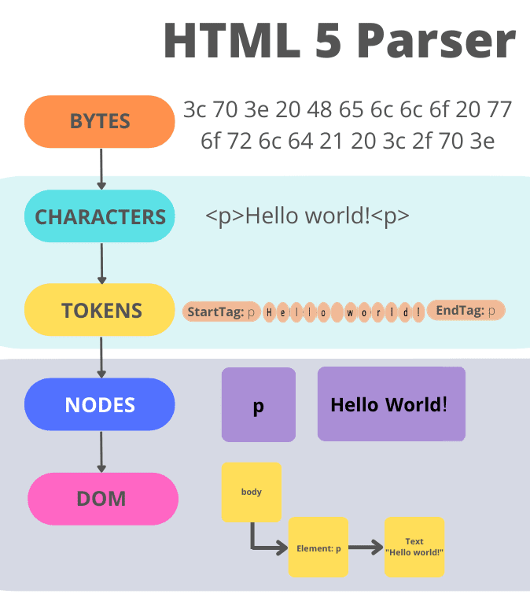
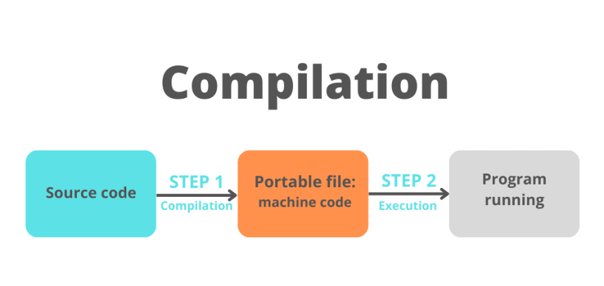
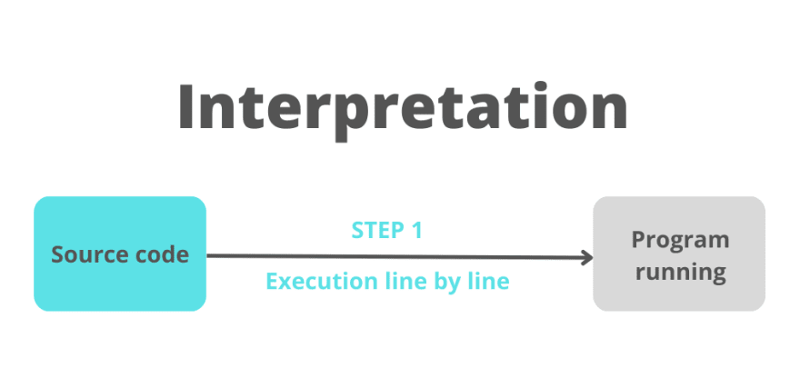
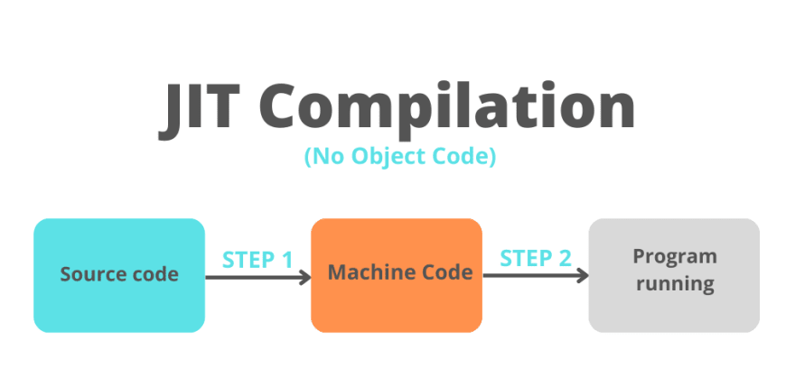

# **Exercise 1.1** {#exercise-1-1}
## Introduction
___
This document answers the questions of exercise 1.1 from Week 1 Assignment. Each question has an individual section for its explaination or answer.

### a.What is the main functionality of the browser?
To understand the main functionality of the browser, we need to first understand what a web browser is. A web browser is a program / software / app which handles different aspects of fetching, displaying and saving resources from the internet.

**So the main functionalities of the browser are -**
1. Browsing the Internet
2. Navigating through various links
3. Downloading Files from the Internet

### b.High Level Components of a browser.
**The High level components of the browser are -**
1. User Interface
2. Browser Engine
3. Rendering Engine
4. Networking
5. Java Script Interpreter
6. UI Backend
7. Data Storage

Let's understand each one in a little more detail.

 <u>User Interface</u> 
    It is the space where interaction between users and the browser occurs. Most of the browsers have common inputs for user interface. Some of them are - an address bar, next and back buttons, buttons for home, refresh and stop, options to bookmark web pages, etc. 

 <u>Browser Engine</u> 
    It is the piece of code that communicates the inputs of user interface with the rendering engine. It is responsible for querying and manipulating the rendering engine according to the inputs from various user interfaces.

<u>Rendering Engine</u> 
    It is the part thoroughly responsible for displaying the requested content on the screen. It first parses the html tags and then using the styles, it builds a render tree and finally a render layout, which displays the content on the screen.

<u>Networking</u> 
    The fraction of the code written in the browser, responsible to send various network calls. For example sending the http requests to the server. 

<u>Java Script Interpreter</u> 
    It is the component of the browser written to interpret the java script code presented in a web page.

<u>UI Backend</u> 
    This draws basic widgets on the browser like combo boxes, windows, etc.

<u>Data Storage</u> 
    It is small database created on the local drive of the computer where the browser is installed. This database stores various files like cache, cookies, etc.

### c.Rendering engine and its use.
It's the part of the web browser that is responsible for displaying the content.

Most commonly, rendering engine involves parsing HTML (the language that describes the structure of web pages) and CSS (the language that describes how HTML should be styled), and then rendering the web page the HTML & CSS describes.

### d.Parsers (HTML, CSS, etc)
After the browser downloads the content from the web server, it has to parse everything so that the web pages are displayed as expected. Let us take a look at different types of parsers.

In other words, parsing means taking the code we write as text (HTML, CSS) and transform it into something that the browser can work with. The parsing will be done by the <mark>browser engine</mark> (not to be confused with the the <mark>Javascript engine</mark> of the browser).

1. <u>HTML Parser</u> 
The very first thing that is done in HTML parsing is tokenization. Tokenization is breaking the html code (obtained from bytes) into parts which contain start tag, end tag and content of the tag.

 

 

2. <u>CSS Parser</u> 
When the browser encounters a CSS stylesheet, be it external or embeded, it needs to parse the text into something it can use for styling the layouts. The data structure that the browser turns the CSS into is called the CSSOM. The DOM and the CSSOM follow similar concepts, in the sense that they are both trees, but they are <mark>different data structures</mark>. Just like building the DOM out of our HTML, building the CSSOM out of CSS is considered a render-blocking process.

 

 

Similar to HTML parsing, CSS parsing starts with tokenization. The CSS parser takes the bytes and converts them into characters, then tokens, then nodes and finally they are linked into the CSSOM. The browser does something called <mark>selector matching</mark> which means that each set of styles will be matched against all nodes (elements) on the page.

### e. Script Processors 
So, after the browser gets the Javascript file / embeded code from the server, the code is interpreted, compiled, parsed and executed. The computer can't understand Javascript code, only the browser can. The JS code needs to be translated into something the computer can work with and this is the job of the <mark>Javascript browser engine</mark> (not to be confused with the <mark>browser engine</mark>). Depending on the browser, JS engines can have different names and work differently.

The JS Parser has different steps.

- Compilation  
During compilation, a piece of software called <mark>the compiler</mark> takes the code written in a high-level language and converts it into machine code, all at once. An intermediate file (called an <mark>object file</mark>) is created and that file can run on any machine. After these steps are taken, the code can be executed (imediately after, sometimes in the future or never).
 

 

- Interpretation  
During interpretation, the interpreter is going through the Javascript code line by line and executes it imediately. No compilation is taking place so no Object Code is created (the output of the code is created by the interpreter itself, using its internal mechanisms). Older versions of Javascript use this type of code execution.
 

 

- JIT Compilation  
<mark>Just in time compilation</mark> is a feature of an interpreter for a given language and it tries to take advantage of both <mark>compilation and interpretation</mark>. Whether during <mark>pure compilation</mark>, the code is translated before it is executed, in <mark>JIT compilation</mark> the code is translated <mark>while it is being executed</mark> (at run time). So we could say that source code is converted to machine code on the fly. Newer versions of Javascript use this type of code execution.
 

 

### f.Tree construction
For rendering, a DOM and CSSOM are merged to form something called a Render Tree. Render Tree has the information required to mark and paint elements on the screen.

 

 
Also while forming a Render Tree, elements like <mark>&lt;head&gt;</mark>, <mark>&lt;link&gt;</mark>, <mark>&lt;script&gt;</mark>, and elements with 'display: none' in CSS are ignored since they are not rendered on the screen.

Note that the elements with 'opacity:0' or 'visibility: none' are included in the render tree, even though they are not painted on the screen they do take their positions and render as an empty space and thus are required for calculations.

### g. Order of script processing
When the browser processes an HTML document, it does so from top to bottom. Upon encountering a &lt;script&gt; tag, it halts (“blocks”) further processing in order to download the referenced script file. Only after that download has completed and the respective JavaScript code has been processed, HTML processing continues.

Let’s imagine the following document:

    `<!DOCTYPE html>
     <html>
     <head>
        <meta charset="utf-8">
        <meta name="viewport" content="width=device-width, initial-scale=1">
        <title>Hello World</title>
        <link rel="stylesheet" href="main.css">
        …
        
     </head>

     <body>
        <h1>Hello World</h1>

        

        
lorem ipsum dolor sit amet

        
     </body>
     </html>`

The browser might actually begin rendering the page even before it has fully downloaded the HTML file. Thus you might see the browser window reading “Hello World” (thanks to the &lt;title&gt; tag) while the page is still blank.

Once we arrive at &lt;script src="foo.js"&gt;, processing halts as described above. Afterwards, we continue to &lt;script src="bar.js"&gt;, repeat the same procedure, and then move on to &lt;script src="baz.js"&gt; for the final piece. That leaves us with the following sequence:

     |
     | |-foo.js-|
     |          |-bar.js-|
     |                   |-baz.js-|
     |
     +------------------------------> t

Concatenation would mean combining these files into a single one:

    |
    | |-foo-bar-baz.js-|
    |
    +------------------------------> t

While the amount of content transferred remains identical, this is generally faster because there’s less networking overhead. (Obviously I’m simplifying a bit here.)

As you might have guessed from this visualization, there’s another approach. We could parallelize the retrieval of JavaScript files:

    |
    | |-foo.js-|
    | |-bar.js-|
    | |-baz.js-|
    |
    +------------------------------> t

The above sums it all up. This is how script processing works.

### h. Layout and Painting

#### <u>The layout process</u>
The layout usually has the following pattern:

1. Parent renderer determines its own width.
2. Parent goes over children and:
    1. Place the child renderer (sets its x and y).
    2. Calls child layout if needed - they are dirty or we are in a global layout, or for some other reason - which calculates the child's height.
3. Parent uses children's accumulative heights and the heights of margins and padding to set its own height - this will be used by the parent renderer's parent.
   
4. Sets its dirty bit to false.

Firefox uses a "state" object(nsHTMLReflowState) as a parameter to layout (termed "reflow"). Among others the state includes the parents width.

The output of the Firefox layout is a "metrics" object(nsHTMLReflowMetrics). It will contain the renderer computed height.

#### Painting
In the painting stage, the render tree is traversed and the renderer's "paint()" method is called to display content on the screen. Painting uses the UI infrastructure component.

#### <u>The Painting order</u>
CSS2 defines the order of the painting process. This is actually the order in which the elements are stacked in the stacking contexts. This order affects painting since the stacks are painted from back to front. The stacking order of a block renderer is:

 - Background color
 - Background image
 - Border
 - Children
 - Outline
